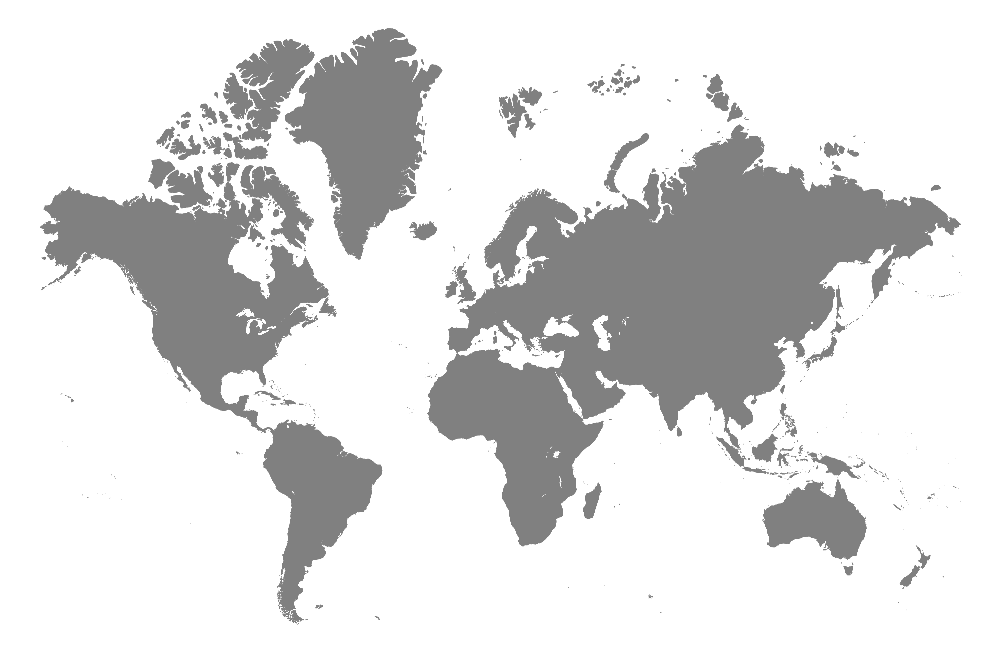

<div align="center">
 
  <h3><b>metric-web_apps</b></h3>
</div>

# 📗 Table of Contents

- [📖 About the Project](#about-project)
    - [🛠 Built With](#built-with)
        - [Tech Stack](#tech-stack)
        - [Key Features](#key-features)
         - [🚀 Live Demo](#live-demo)
         - [🚀 Live Video](#live-video)
- [💻 Getting Started](#getting-started)
    - [Setup](#setup)
    - [Prerequisites](#prerequisites)
    - [Install](#install)
    - [Usage](#usage)
- [👥 Authors](#authors)
- [🤝 Contributing](#contributing)
- [⭐️ Show your support](#support)
- [🙏 Acknowledgements](#acknowledgements)
- [📝 License](#license)

# 📖 <a name="about-project">Metrics Web App</a>

**[metric-web_apps]** metric-web_apps is a mobile application built using React and Redux. It empowers users to explore countries and cities, offering access to comprehensive air quality information for each city. This data is sourced from an external API, enhancing user awareness of air quality conditions.


## 🛠 Built With <a name="built-with"></a>

1-HTML.
2-CSS.
3-JavaScript.
3-LINTERS.
4-React.

### Tech Stack <a name="tech-stack"></a>

<details>
  <summary>HTML</summary>
</details>
<details>
  <summary>CSS</summary>
</details>
<details>
  <summary>JavaScript</summary>
</details>
<details>
<summary>Visual Code IDE / WebStorm IDE</summary>
</details>
<details>
<summary>React</summary>
</details>

<!-- Features -->

### Key Features <a name="key-features"></a>

- **Semantic HTML Tags with content for each corresponding Section**
- **React**
- **CSS Styling, UI improvements**


<p align="right">(<a href="#readme-top">back to top</a>)</p>

<p>For Live demo click
<a href="https://lustrous-cat-e555f7.netlify.app/"> here </a></p>


## 🚀 Live Video <a name="live-video"></a>

<p>For Live video presentation click
<a href="https://www.loom.com/share/29a54da429814442bb0f81b40bd57d44?sid=231c5f4f-feee-4e69-a1c2-19f5d7e4e482"> here </a></p>


## 💻 Getting Started <a name="getting-started"></a>

To get a local copy up and running, follow these steps.

### Prerequisites

1- Web browser
2- Code editor
3- Version Control System (git)

### Setup

Clone this repository to your desired folder:

Run this commands:

```sh
cd my-folder
git clone https://github.com/mohashyne/metric-web_apps-capstone-.git
```

-

### Install

Install this project with:

Run this command:

```sh
  cd metric-web_apps-capstone-
  npm install
```

### Usage

To run the project, execute the following command:

```
launch index.html using live server or live preview
```


<p align="right">(<a href="#readme-top">back to top</a>)</p>


<p align="right">(<a href="#readme-top">back to top</a>)</p>

<!-- AUTHORS -->

## 👥 Authors <a name="authors"></a>

👤 **Muhammad Aminu Salihu**

- GitHub: [@mohashyne](https://github.com/mohashyne)
- Twitter: [@muhammadslyhu](https://twitter.com/muhammadsalyhu)
- LinkedIn: [muhammad-salihu-27467a165](https://linkedin.com/in/msalyhu)


## 🔭 Future Features <a name="future-features"></a>

- Layout improvement, Navigation and Improved Header and Footer Sections.

<p align="right">(<a href="#readme-top">back to top</a>)</p>

## 🤝 Contributing <a name="contributing"></a>

Contributions, issues, and feature requests are welcome!

Feel free to check the <a href="https://github.com/mohashyne/metric-web_apps-capstone-/issues">issues page</a>.

<p align="right">(<a href="#readme-top">back to top</a>)</p>

## ⭐️ Show your support <a name="support"></a>

If you like this project Please Rate IT!

<p align="right">(<a href="#readme-top">back to top</a>)</p>

## 🙏 Acknowledgments <a name="acknowledgements"></a>

I would like to thank my colleagues at Microverse for their support during the project.
Original design idea by <a href="https://www.behance.net/sakwadesignstudio">Nelson Sakwa on Behance.</a>
Used as per the <a href="https://creativecommons.org/licenses/by-nc/4.0/Creative"> Commons license of the design </a>

<p align="right">(<a href="#readme-top">back to top</a>)</p>

## 📝 License <a name="license"></a>

This project is [MIT](MIT.md) licensed.

<p align="right">(<a href="#readme-top">back to top</a>)</p>
<div align="center">
 
  <h3><b>metric-web_apps</b></h3>
</div>

# 📗 Table of Contents

- [📖 About the Project](#about-project)
    - [🛠 Built With](#built-with)
        - [Tech Stack](#tech-stack)
        - [Key Features](#key-features)
         - [🚀 Live Demo](#live-demo)
         - [🚀 Live Video](#live-video)
- [💻 Getting Started](#getting-started)
    - [Setup](#setup)
    - [Prerequisites](#prerequisites)
    - [Install](#install)
    - [Usage](#usage)
- [👥 Authors](#authors)
- [🤝 Contributing](#contributing)
- [⭐️ Show your support](#support)
- [🙏 Acknowledgements](#acknowledgements)
- [📝 License](#license)

# 📖 <a name="about-project">Metrics Web App</a>

**[metric-web_apps]** metric-web_apps is a mobile application built using React and Redux. It empowers users to explore countries and cities, offering access to comprehensive air quality information for each city. This data is sourced from an external API, enhancing user awareness of air quality conditions.


## 🛠 Built With <a name="built-with"></a>

1-HTML.
2-CSS.
3-JavaScript.
3-LINTERS.
4-React.

### Tech Stack <a name="tech-stack"></a>

<details>
  <summary>HTML</summary>
</details>
<details>
  <summary>CSS</summary>
</details>
<details>
  <summary>JavaScript</summary>
</details>
<details>
<summary>Visual Code IDE / WebStorm IDE</summary>
</details>
<details>
<summary>React</summary>
</details>

<!-- Features -->

### Key Features <a name="key-features"></a>

- **Semantic HTML Tags with content for each corresponding Section**
- **React**
- **CSS Styling, UI improvements**


<p align="right">(<a href="#readme-top">back to top</a>)</p>

<p>For Live demo click
<a href="https://mohashyne.github.io/metric-web_apps-capstone-/"> here </a></p>


## 🚀 Live Video <a name="live-video"></a>

<p>For Live video presentation click
<a href="https://www.loom.com/share/29a54da429814442bb0f81b40bd57d44?sid=231c5f4f-feee-4e69-a1c2-19f5d7e4e482"> here </a></p>


## 💻 Getting Started <a name="getting-started"></a>

To get a local copy up and running, follow these steps.

### Prerequisites

1- Web browser
2- Code editor
3- Version Control System (git)

### Setup

Clone this repository to your desired folder:

Run this commands:

```sh
cd my-folder
git clone https://github.com/mohashyne/metric-web_apps-capstone-.git
```

-

### Install

Install this project with:

Run this command:

```sh
  cd metric-web_apps-capstone-
  npm install
```

### Usage

To run the project, execute the following command:

```
launch index.html using live server or live preview
```


<p align="right">(<a href="#readme-top">back to top</a>)</p>


<p align="right">(<a href="#readme-top">back to top</a>)</p>

<!-- AUTHORS -->

## 👥 Authors <a name="authors"></a>

👤 **Muhammad Aminu Salihu**

- GitHub: [@mohashyne](https://github.com/mohashyne)
- Twitter: [@muhammadslyhu](https://twitter.com/muhammadsalyhu)
- LinkedIn: [muhammad-salihu-27467a165](https://linkedin.com/in/msalyhu)


## 🔭 Future Features <a name="future-features"></a>

- Layout improvement, Navigation and Improved Header and Footer Sections.

<p align="right">(<a href="#readme-top">back to top</a>)</p>

## 🤝 Contributing <a name="contributing"></a>

Contributions, issues, and feature requests are welcome!

Feel free to check the <a href="https://github.com/mohashyne/metric-web_apps-capstone-/issues">issues page</a>.

<p align="right">(<a href="#readme-top">back to top</a>)</p>

## ⭐️ Show your support <a name="support"></a>

If you like this project Please Rate IT!

<p align="right">(<a href="#readme-top">back to top</a>)</p>

## 🙏 Acknowledgments <a name="acknowledgements"></a>

I would like to thank my colleagues at Microverse for their support during the project.
Original design idea by <a href="https://www.behance.net/sakwadesignstudio">Nelson Sakwa on Behance.</a>
Used as per the <a href="https://creativecommons.org/licenses/by-nc/4.0/Creative"> Commons license of the design </a>

<p align="right">(<a href="#readme-top">back to top</a>)</p>

## 📝 License <a name="license"></a>

This project is [MIT](MIT.md) licensed.

<p align="right">(<a href="#readme-top">back to top</a>)</p>